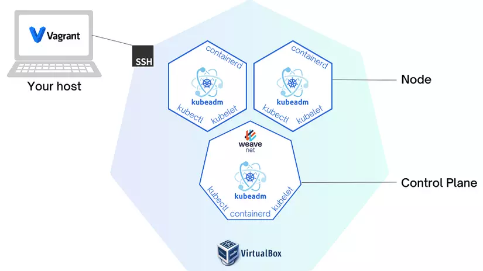

# k8s-cluster-deployment


## Single node:
1. Install container runtime (Docker)

- Set up the repository:
```yml
sudo apt-get update
-------------------------------------------------------------------------------------------------------
sudo apt-get install ca-certificates curl gnupg
```
```yml
sudo install -m 0755 -d /etc/apt/keyrings
-------------------------------------------------------------------------------------------------------
curl -fsSL https://download.docker.com/linux/ubuntu/gpg | sudo gpg --dearmor -o /etc/apt/keyrings/docker.gpg
sudo chmod a+r /etc/apt/keyrings/docker.gpg
```

```yml
echo \
  "deb [arch="$(dpkg --print-architecture)" signed-by=/etc/apt/keyrings/docker.gpg] https://download.docker.com/linux/ubuntu \
  "$(. /etc/os-release && echo "$VERSION_CODENAME")" stable" | \
  sudo tee /etc/apt/sources.list.d/docker.list > /dev/null
```

```yml
sudo apt-get update
-------------------------------------------------------------------------------------------------------
sudo apt-get install docker-ce docker-ce-cli containerd.io docker-buildx-plugin docker-compose-plugin -y
```

> Add current user in docker group by the command: `sudo usermod -aG docker $USER`. The user needs to Log out and log back into the Ubuntu server by command: `sudo reboot` so that group membership is re-evaluated. After that the user will be able to run Docker commands without using root or sudo.
2. Install kubeadm, kubelet, kubectl in each node:
- Disable swap space in `each node`:
```yml
# Disable swap
sudo swapoff -a

# Disable swap every time node starts in /etc/fstab
sudo sed -i '/ swap / s/^\(.*\)$/#\1/g' /etc/fstab

```
- Install tools:
```yml
sudo apt-get update
-------------------------------------------------------------------------------------------------------
sudo apt-get install -y apt-transport-https ca-certificates curl
```
```yml
sudo mkdir -m 0755 -p /etc/apt/keyrings
-------------------------------------------------------------------------------------------------------
sudo curl -fsSLo /etc/apt/keyrings/kubernetes-archive-keyring.gpg https://dl.k8s.io/apt/doc/apt-key.gpg

```

```yml
echo "deb [signed-by=/etc/apt/keyrings/kubernetes-archive-keyring.gpg] https://apt.kubernetes.io/ kubernetes-xenial main" | sudo tee /etc/apt/sources.list.d/kubernetes.list
```

```yml
sudo apt-get update
-------------------------------------------------------------------------------------------------------
sudo apt-get install -y kubelet kubeadm kubectl
-------------------------------------------------------------------------------------------------------
sudo apt-mark hold kubelet kubeadm kubectl
```
3. Init control plane:
- Init master node:
```yml
kubeadm init --apiserver-advertise-address=<IP_node_master> --pod-network-cidr=192.168.0.0/16
```
> Should save the command `kubectl join <IP_node_master>:6443 --token...` appeared in output after running the above command. It's responsible for helping other nodes to join the cluster.

**NOTE**: If you get the error after execute `kubeadm init` command like:
```yml
k8s@master-node:~$ sudo kubeadm init --apiserver-advertise-address=192.168.122.92 --pod-network-cidr=192.168.0.0/16 --ignore-preflight-errors=...
[init] Using Kubernetes version: v1.28.2
[preflight] Running pre-flight checks
error execution phase preflight: [preflight] Some fatal errors occurred:
	[ERROR CRI]: container runtime is not running: output: time="2023-09-25T03:58:00Z" level=fatal msg="validate service connection: CRI v1 runtime API is not implemented for endpoint \"unix:///var/run/containerd/containerd.sock\": rpc error: code = Unimplemented desc = unknown service runtime.v1.RuntimeService"
, error: exit status 1
[preflight] If you know what you are doing, you can make a check non-fatal with `--ignore-preflight-errors=...`
To see the stack trace of this error execute with --v=5 or higher
```
**Solution:**
```yml
rm /etc/containerd/config.toml
-------------------------------------------------------------------------------------------------------
systemctl restart containerd
-------------------------------------------------------------------------------------------------------
kubeadm init --apiserver-advertise-address=<IP_node_master> --pod-network-cidr=192.168.0.0/16
```
**Result:**
```yml
k8s@master-node:~$ sudo kubeadm init --apiserver-advertise-address=192.168.122.92 --pod-network-cidr=192.168.0.0/16 
[init] Using Kubernetes version: v1.28.2
[preflight] Running pre-flight checks
[preflight] Pulling images required for setting up a Kubernetes cluster
[preflight] This might take a minute or two, depending on the speed of your internet connection
[preflight] You can also perform this action in beforehand using 'kubeadm config images pull'
W0925 03:59:50.542766    8652 checks.go:835] detected that the sandbox image "registry.k8s.io/pause:3.6" of the container runtime is inconsistent with that used by kubeadm. It is recommended that using "registry.k8s.io/pause:3.9" as the CRI sandbox image.
[certs] Using certificateDir folder "/etc/kubernetes/pki"
[certs] Generating "ca" certificate and key
[certs] Generating "apiserver" certificate and key
[certs] apiserver serving cert is signed for DNS names [kubernetes kubernetes.default kubernetes.default.svc kubernetes.default.svc.cluster.local master-node] and IPs [10.96.0.1 192.168.122.92]
[certs] Generating "apiserver-kubelet-client" certificate and key
[certs] Generating "front-proxy-ca" certificate and key
[certs] Generating "front-proxy-client" certificate and key
[certs] Generating "etcd/ca" certificate and key
[certs] Generating "etcd/server" certificate and key
[certs] etcd/server serving cert is signed for DNS names [localhost master-node] and IPs [192.168.122.92 127.0.0.1 ::1]
[certs] Generating "etcd/peer" certificate and key
[certs] etcd/peer serving cert is signed for DNS names [localhost master-node] and IPs [192.168.122.92 127.0.0.1 ::1]
[certs] Generating "etcd/healthcheck-client" certificate and key
[certs] Generating "apiserver-etcd-client" certificate and key
[certs] Generating "sa" key and public key
[kubeconfig] Using kubeconfig folder "/etc/kubernetes"
[kubeconfig] Writing "admin.conf" kubeconfig file
[kubeconfig] Writing "kubelet.conf" kubeconfig file
[kubeconfig] Writing "controller-manager.conf" kubeconfig file
[kubeconfig] Writing "scheduler.conf" kubeconfig file
[etcd] Creating static Pod manifest for local etcd in "/etc/kubernetes/manifests"
[control-plane] Using manifest folder "/etc/kubernetes/manifests"
[control-plane] Creating static Pod manifest for "kube-apiserver"
[control-plane] Creating static Pod manifest for "kube-controller-manager"
[control-plane] Creating static Pod manifest for "kube-scheduler"
[kubelet-start] Writing kubelet environment file with flags to file "/var/lib/kubelet/kubeadm-flags.env"
[kubelet-start] Writing kubelet configuration to file "/var/lib/kubelet/config.yaml"
[kubelet-start] Starting the kubelet
[wait-control-plane] Waiting for the kubelet to boot up the control plane as static Pods from directory "/etc/kubernetes/manifests". This can take up to 4m0s
[apiclient] All control plane components are healthy after 6.001169 seconds
[upload-config] Storing the configuration used in ConfigMap "kubeadm-config" in the "kube-system" Namespace
[kubelet] Creating a ConfigMap "kubelet-config" in namespace kube-system with the configuration for the kubelets in the cluster
[upload-certs] Skipping phase. Please see --upload-certs
[mark-control-plane] Marking the node master-node as control-plane by adding the labels: [node-role.kubernetes.io/control-plane node.kubernetes.io/exclude-from-external-load-balancers]
[mark-control-plane] Marking the node master-node as control-plane by adding the taints [node-role.kubernetes.io/control-plane:NoSchedule]
[bootstrap-token] Using token: z28sye.coc4yiy9gixgu2ap
[bootstrap-token] Configuring bootstrap tokens, cluster-info ConfigMap, RBAC Roles
[bootstrap-token] Configured RBAC rules to allow Node Bootstrap tokens to get nodes
[bootstrap-token] Configured RBAC rules to allow Node Bootstrap tokens to post CSRs in order for nodes to get long term certificate credentials
[bootstrap-token] Configured RBAC rules to allow the csrapprover controller automatically approve CSRs from a Node Bootstrap Token
[bootstrap-token] Configured RBAC rules to allow certificate rotation for all node client certificates in the cluster
[bootstrap-token] Creating the "cluster-info" ConfigMap in the "kube-public" namespace
[kubelet-finalize] Updating "/etc/kubernetes/kubelet.conf" to point to a rotatable kubelet client certificate and key
[addons] Applied essential addon: CoreDNS
[addons] Applied essential addon: kube-proxy

Your Kubernetes control-plane has initialized successfully!

To start using your cluster, you need to run the following as a regular user:

  mkdir -p $HOME/.kube
  sudo cp -i /etc/kubernetes/admin.conf $HOME/.kube/config
  sudo chown $(id -u):$(id -g) $HOME/.kube/config

Alternatively, if you are the root user, you can run:

  export KUBECONFIG=/etc/kubernetes/admin.conf

You should now deploy a pod network to the cluster.
Run "kubectl apply -f [podnetwork].yaml" with one of the options listed at:
  https://kubernetes.io/docs/concepts/cluster-administration/addons/

Then you can join any number of worker nodes by running the following on each as root:

kubeadm join 192.168.122.92:6443 --token z28sye.coc4yiy9gixgu2ap \
	--discovery-token-ca-cert-hash sha256:1c6160df2a8bc738f6aacd4cc1680ed228be0109e629672df0e530780c453b77 
```

```yml
mkdir -p $HOME/.kube
-------------------------------------------------------------------------------------------------------
sudo cp -i /etc/kubernetes/admin.conf $HOME/.kube/config
-------------------------------------------------------------------------------------------------------
sudo chown $(id -u):$(id -g) $HOME/.kube/config
```
- Install plugin network to help nodes in cluster can communicate together. (Choose plugin `Calico`)
```yml
# Install the Tigera Calico operator and custom resource definitions.
kubectl create -f https://raw.githubusercontent.com/projectcalico/calico/v3.26.0/manifests/tigera-operator.yaml
-------------------------------------------------------------------------------------------------------
# Install Calico by creating the necessary custom resource. For more information on configuration options available in this manifest.
kubectl create -f https://raw.githubusercontent.com/projectcalico/calico/v3.26.0/manifests/custom-resources.yaml
-------------------------------------------------------------------------------------------------------
# Confirm that all of the pods are running with the following command.
watch kubectl get pods -n calico-system
-------------------------------------------------------------------------------------------------------
# Remove the taints on the control plane so that you can schedule pods on it.
kubectl taint nodes --all node-role.kubernetes.io/control-plane-
kubectl taint nodes --all node-role.kubernetes.io/master-
# Expected output: node/<your-hostname> untainted
```
- Run command to check the result:
```yml
kubectl cluster-info
-------------------------------------------------------------------------------------------------------
kubectl get nodes -o wide
```
[Go to Calico quickstart website here!](https://docs.tigera.io/calico/latest/getting-started/kubernetes/quickstart)

## Multi nodes:
- Can use the command saved in step `init control plane/init master node` above.

```yml
sudo kubeadm join --token <token> <control-plane-host>:<control-plane-port> --discovery-token-ca-cert-hash sha256:<hash>
```

- If you forget the command `kubeadm join`, follow the step below to get token and hash code:
```yml
# Get token
kubeadm token list
-------------------------------------------------------------------------------------------------------
# Get hash code
openssl x509 -pubkey -in /etc/kubernetes/pki/ca.crt | openssl rsa -pubin -outform der 2>/dev/null | \
openssl dgst -sha256 -hex | sed 's/^.* //'
```

- If the token expires (after 24 hours), let create new token:
```yml
kubeadm token create
```
